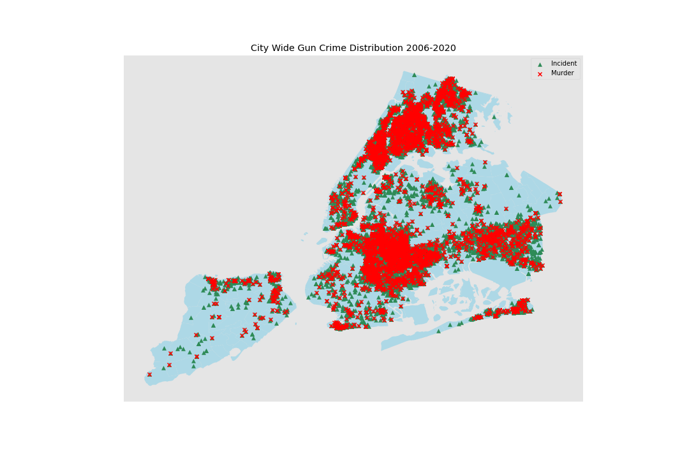

# Examining Gun Violence in NYC from 2006-2020
## Did the propensity of NYPD's controversial Stop-And-Frisk policy curtail gun violence?

#### I explore NYPD's own dataset of every shooting incident reported in two parts: 2006-2013, and 2013-2020. The year 2013 marks the official disbanding of Stop-and-Frisk, and I aim to see whether there is a statistically significant difference in murder rates before and after this time period. 

## Background
#### Stop-and-Frisk is a controversial policing method practiced by the NYPD from 2002 to 2013, where officers stopped and frisked individuals they thought posed a risk of carrying a weapon. It has since been disbanded because of the racial profiling it proliferated. However, supporters of the Stop-and-Frisk program argue that it is instrumental in preventing gun crime - specifically murder. I wanted to see if there was any statistical truth to that claim. 

## Data and Exploratory Data Analysis
#### I utilized the City of New York's public data resources to acquire [NYPD's historic dataset of every shooting incident reported between 2006 and 2020](https://data.cityofnewyork.us/Public-Safety/NYPD-Shooting-Incident-Data-Historic-/833y-fsy8). Additonally, I used [NYPD's historic dataset of every stop and frisk event reported](https://www1.nyc.gov/site/nypd/stats/reports-analysis/stopfrisk.page) to track the number of stops made through the time period of interest. Lastly, I used this [public geospatial dataset of the city](https://data.beta.nyc/dataset/pediacities-nyc-neighborhoods) to accurately map out locations. 

 
#### In exploring the shooting incident dataset, I found that of the total 23,568 shooting incidents reported from 2006 - 2020, 4488 were murders. Most of these shooting incidents, unsurprisingly, happen in low-income areas. Additionally, I noticed that the year 2013, the year Stop-and-Frisk was dismantled, seemed to be an outlier, and registers as having the lowest rate of murder throughout this time period. 

#### By using the coordinates included in the dataset, I was able to map out every incident and murder and visualize the geographical distribution of these incidents.

## Null Hypothesis Testing
#### The null hypothesis I decided testing is : The average rate of murder before 2013 is equal to the average rate of murder after. I chose 2013 as a pivot point for a couple of reasons; it is both an outlier and a period of transition, and I want to be stringent about only analyzing from two separate time periods. 
#### Initially I intuited that these murder to shooting incidents could be binomially distributed, with the incidents being the number of trials and the murders being the number of successes (for lack of a better word). I then approximated this binomial distribution with a normal one. Since I am comparing rates and not actual counts of shooting incidents and murder, I decided to use a two sample z-test, with the two samples being pre-2013 and post-2013. I set my alpha to .02 because I want to be really stringent : I am making a lot of assumptions about the nature of independence with these shooting incidents, and did not fully analyze possible demographic trends like poverty and housing availability which may also affect the change of murder rates over time. 

#### By using the normal distribution of the difference in rates, I was able to establish a p-value of approximately .08. Since this is above our alpha threshhold, I cannot reject the null hypothesis that the murder rates of these two time frames are the same. 

## What's the point?

